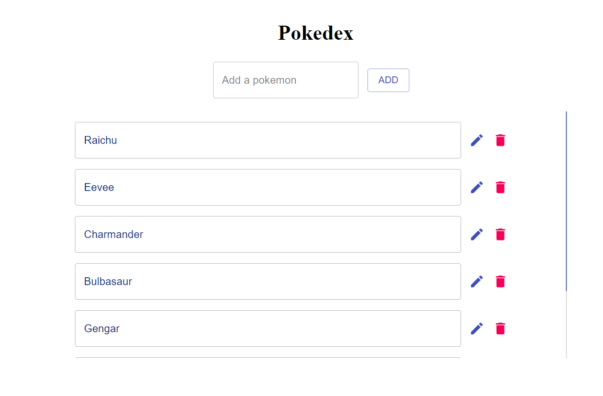

**Name:** Ng Shi Wei

**Admission No.:** A0185450E

# B4
## Run locally
1. Go to https://github.com/shiweing/pokemon-rest-app
1. Switch to branch `b4`
1. Clone the repository locally
1. Open the command prompt in the repository folder
1. Run `npm install`
1. `cd server` and run `npm install`
1. Return to parent directory `cd ..` and enter the command `npm start`
1. Open a browser and go to http://localhost:8080
1. The webpage should display as below (but the list will be empty)

## Add
1. Enter in the "Add a pokemon" text field
1. Click "Add"

1. The list of pokemons should refresh and display the newly added pokemon

## Edit
1. Click the Edit icon beside the pokemon to edit

1. The field should be editable now

1. Update the pokemon name and click the Done button

1. The list of pokemons will refresh and display the updated pokemon

## Delete
1. Click the Delete icon beside the pokemon to delete

1. The list of pokemons will be refreshed and the pokemon will be deleted