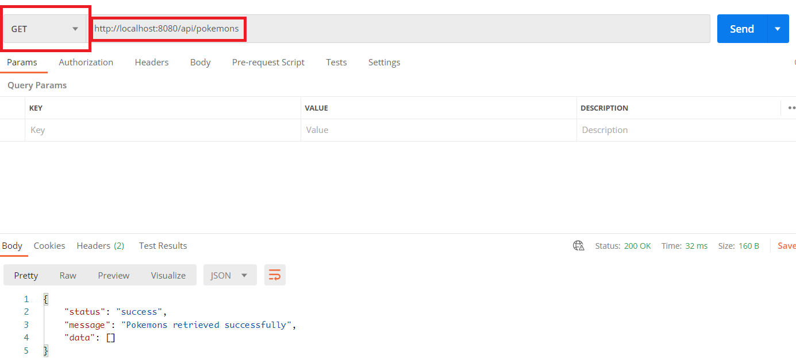
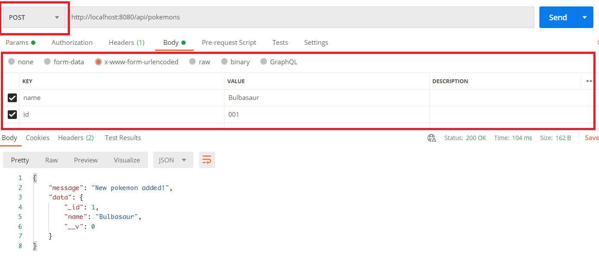
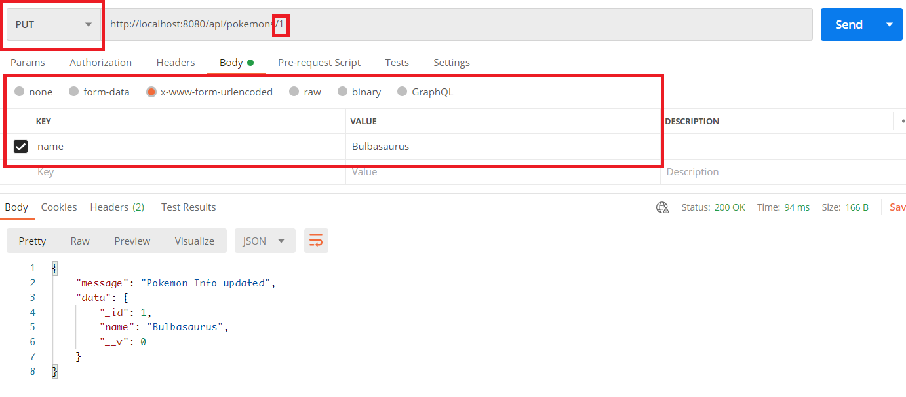
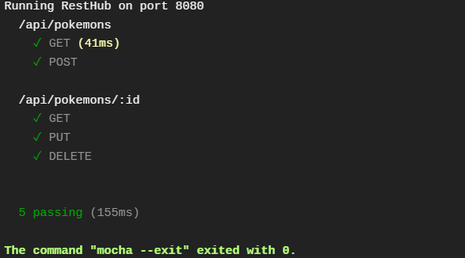

**Name:** Ng Shi Wei

**Admission No.:** A0185450E

# Instructions
## Run API locally (B1)
1. Go to https://github.com/shiweing/pokemon-rest-app
1. Clone the repository locally
1. Open the command prompt in the repository folder
1. Enter the command `node index.js`
1. Open a browser and go to http://localhost:8080
1. The page should state `Welcome to the world of Pokemons!`

## Accessing API with Postman (B1 & B3)
1. Go to https://www.postman.com/
1. Sign up for an account and launch the workspace


### **GET** API call
1. Select **GET** as the request type and enter `http://localhost:8080/api/pokemons` as url
1. Click **Send**

1. The request result will be shown

> If an error appears like the following image  download the chrome plugin to unblock CORS when testing at https://chrome.google.com/webstore/detail/cors-unblock/lfhmikememgdcahcdlaciloancbhjino?hl=en

### **POST** API call
1. Select **POST** as the request type and enter `http://localhost:8080/api/pokemons` as url
1. Open the body tab and select **x-www-form-urlencoded**
1. Add the parameters as shown below
1. Click **Send**
1. A response indicating that the pokemon has been added will be returned.

1. Run the GET request to see the new contact being returned

### **PUT** API call
1. Run the GET request and copy the id of the pokemon that was just added.
1. Select **PUT** as the request type and enter `http://localhost:8080/api/pokemons/[id]` as url (where `[id]` is the id that was copied)
1. Change the value of the name parameter under body
1. Click **Send**
1. A response indicating that the contact has been updated will be returned.

1. Run the GET request to see the contact has been updated

### **DELETE** API call
1. Run the GET request and copy the id of the pokemon that was just added.
1. Select **DELETE** as the request type and enter `http://localhost:8080/api/pokemons/[id]` as url (where `[id]` is the id that was copied)
1. Click **Send**
1. A response indicating that the pokemon has been deleted will be returned.

1. Run the GET request to see the contact has been deleted

> :warning: Replace `http://localhost:8080` with `https://pokemon-rest-app.herokuapp.com/` to test the deployed endpoint

## Testing (B2)
- Test cases are written with mocha and chai-http.

**Testing locally**
- Run `npm run test` on a local copy of the application to run the tests locally.

**Automated testing**
- Travis is used as the CI tool to automate testing
- The command `mocha --exit` is added to `.travis.yml` to initialise the testing
- Below is the results of the travis build


## Continuus deployment (B3)
- Heroku was chosen as the cloud service for deployment.

### .travis.yml
- The follwoing was appended to `.travs.yml`
    ```
    deployment:
        provider: heroku
        api-key:
            secure: <encrypted-api-key>
        app: <heroku-app-name>
        on:
            repo: <repo-path>
    ```
- To get the api key, install travis and heroku command line clients
- Run `heroku auth:token` to get the api key.
- Copy the api key and run `travis encrypt <api-key> --add deploy.api_key`
- The encrypted api-key will be generated

### MongoDB
- To utilise mongodb on Heroku, MongoDB Atlas is required.
- Create an account on MongoDB Atlas, and create a new project
- Select `Build a cluster` on the new project
    - Select a Cloud Provider
    - Select a Region
    - Enter a name for the cluster
- After the cluster is created, click on `Database Access` in the left menu
- Select `Add a new user`
    - Enter a username and password
    - Set the `User Privileges` to `Read and write to any database`
    - Save the settings
- Click on `Network Access` in the left menu
- Click on `Add IP Address`
    - `Allow Access from Anywhere` is selected for this app, but for an IP address should be specified for a secure deployment
- Click on `Clusters`
- Click `Connect > Connect Your Application`
    - A connection string will be displayed, copy the string
- Go to the Heroku dashboard for the application, under `Settings`
    - Add a config variable `MONGODB_URI: <connection string>`
    - Replace `<password>` in the connection string with the password set for the created DB user.
